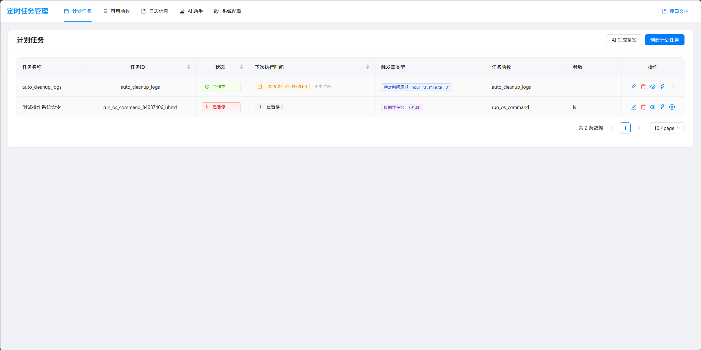
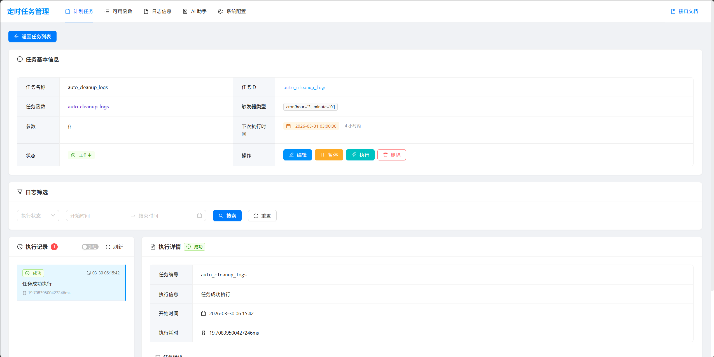
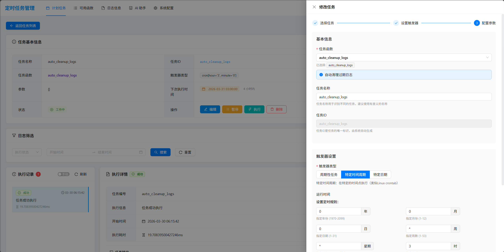
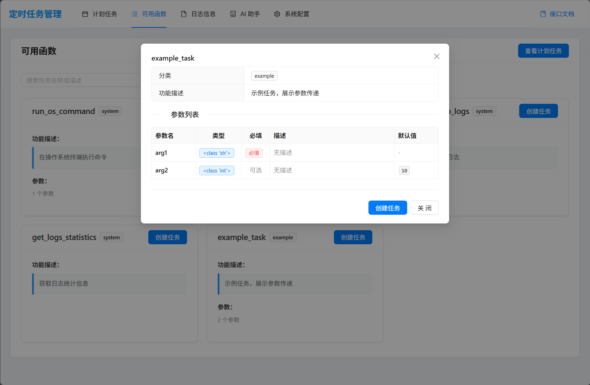
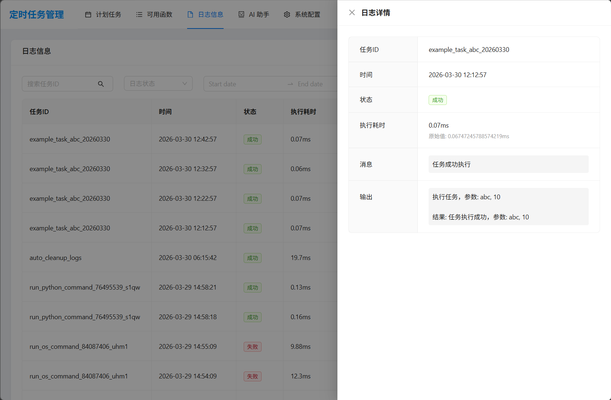
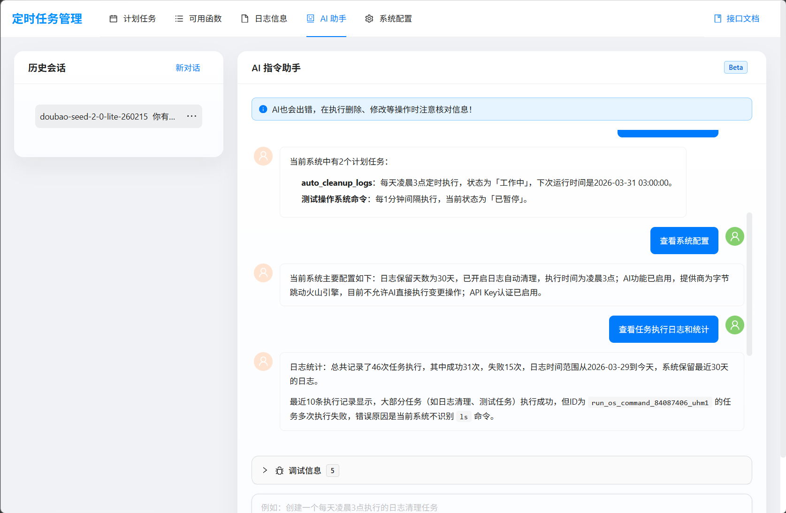
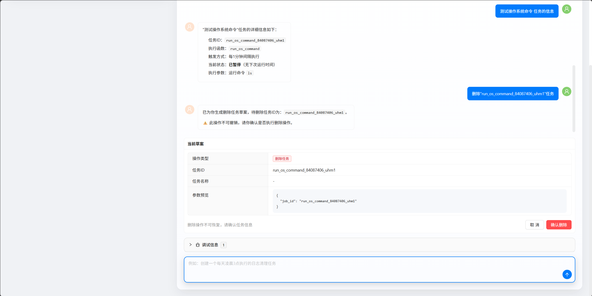
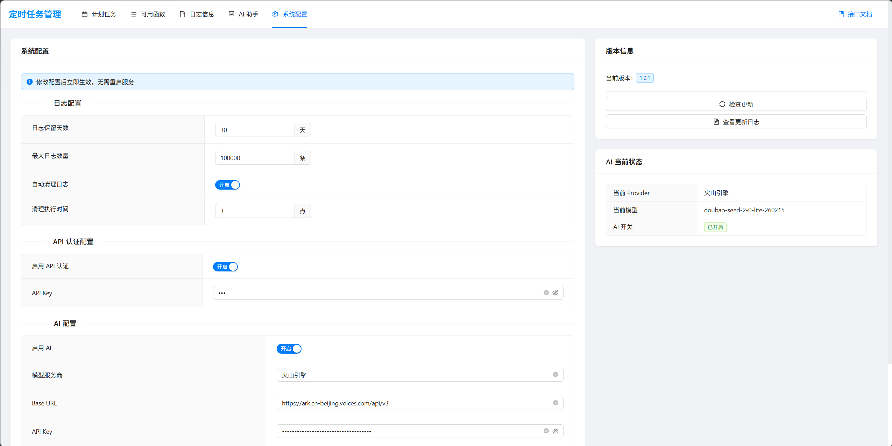

# 

FAVS前端部分

> 一个让定时任务管理变得优雅愉悦的可视化面板

厌倦了在命令行里敲 APScheduler 的配置？想要一个漂亮的界面来管理你的定时任务？这个项目就是你的答案！

## ✨ 特性

- 📋 **任务管理** - 创建、修改、删除、暂停、恢复，一个界面搞定
- 🤖 **AI 助手** - 用自然语言描述需求，AI 自动生成任务草案
- 📊 **实时监控** - 任务状态、执行记录、运行日志一目了然
- 🔐 **安全认证** - 支持 API Key 认证，保护你的任务不被误操作
- 🎨 **现代 UI** - 基于 Ant Design Vue，界面美观、响应式设计
- ⚡ **即时生效** - 配置修改立即生效，无需重启服务

## 🛠️ 技术栈

- **框架**: Vue 3 + TypeScript
- **UI 库**: Ant Design Vue 4.x
- **构建工具**: Vite
- **路由**: Vue Router
- **HTTP**: Axios
- **AI 对话**: ant-design-x-vue + SSE 流式响应

## 🚀 快速开始

```bash
# 安装依赖
npm install

# 启动开发服务器
npm run dev

# 构建生产版本
npm run build
```

**环境配置**: 在 `.env` 文件中设置后端 API 地址

```env
VITE_BASE_URL=http://localhost:8000
```

## 📸 界面预览

| 任务列表 | 创建任务 |
|:---:|:---:|
|  |  |

| 任务详情 | 运行日志 |
|:---:|:---:|
|  |  |

| AI 助手 | 系统配置 |
|:---:|:---:|
|  |  |

| 版本信息 | 更新日志 |
|:---:|:---:|
|  |  |

## 📦 相关项目

- **后端**: [fastapi-apscheduler-visual](https://github.com/mocehu/fastapi-apscheduler-visual) - 基于 FastAPI + APScheduler

## 📄 许可证

MIT License
